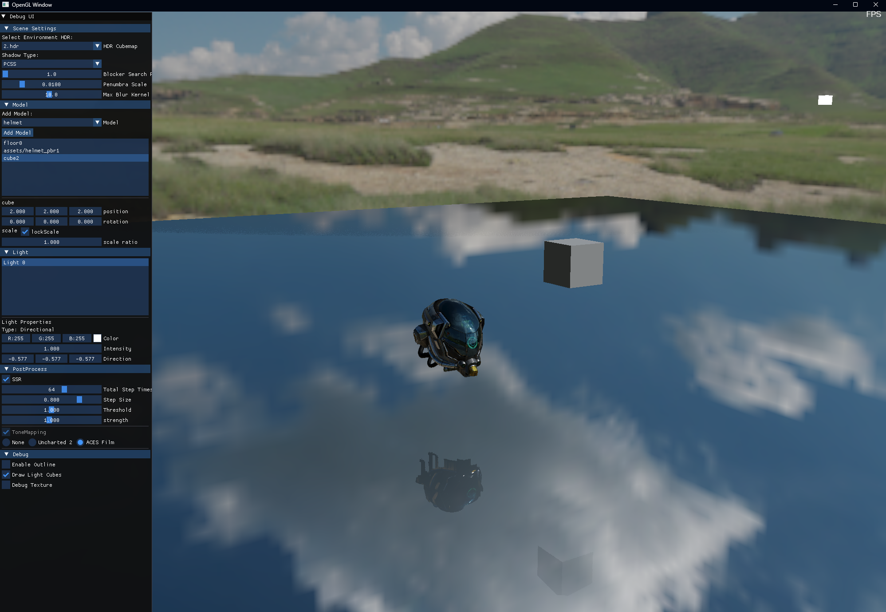

# OpenGL 渲染器开发进度记录

本项目为一个基于现代 OpenGL 的实时渲染器，目标是实现一个具备物理真实感的、可扩展的多通道渲染框架，支持复杂材质、光照与后处理效果。

---

## ✅ 已完成功能

### 🌈 渲染架构
- 延迟渲染管线（Shadow + G-Buffer + Lighting + Postprocess）

### ✨ 光照与材质
- PBR 材质系统（Metallic-Roughness 流程）
- IBL（环境光照，含镜面反射）

### 🔦 阴影
- Shadow Pass（shadowMap、PCF、PCSS）

### 🪞 屏幕空间效果
- SSR（屏幕空间反射）

### 🧪 调试与控制
- ImGui 实时调参界面
- 支持生成的纹理实时显示

---

## 🚧 待实现功能（TODO）
- [ ] 透明物体渲染
- [ ] SSAO（屏幕空间环境光遮蔽）
- [ ] 泛光、运动模糊、景深
- [ ] SSGI（屏幕空间全局光照）
- [ ] 抗锯齿
- [ ] 体积云、体积雾
- [ ] GPU 性能分析工具（各Pass耗时可视化）
- [ ] 光线追踪（路径追踪）
- [ ] 水体渲染
- [ ] 次表面散射 
---

# OpenGL学习(第一次学习时的笔记，保留一下)

## OpenGL

- 双缓冲: 在每一帧绘制任务完成后，把背后的缓冲区交换到前台，再之前的缓冲区绘制下一帧。
- 错误处理:`glGetError()`检查之前的调用是否出错
- NDC:标准化设备坐标，按比例缩放
- VBO(Vertex Buffer Object):表示了GPU上的一段存储空间对象，在Cpp中表现为unsigned int变量，表示成为GPU端内存对象的一个ID编号
- VAO(Vertex Array Object):顶点数组对象，用于存储一个Mesh网格所有的顶点属性描述信息
- EBO(Element Buffer Object):存储顶点绘制顺序索引号，这样就可以复用一些顶点（两个三角形有共用边的情况）
    - 描述一个三角形使用了那几个顶点数据的数字序列

# 库

- GLFW
- GLAD

## GLSL语言

为图形计算量身定制的语言
特点：1. 本质是输入转化为输出 2. 程序之间无法通信，只能通过输入和输出进行通信

基本数据类型：

- float
- double
- void
- int
- bool
  向量数据类型：(第一个字母表示基本数据类型v:float, d:double,b:bool,i:int,u:unsigned int)
- vecn
- bvecn
- ivecn
- uvecn
- dvecn
  向量初始化： vec3 color0=vec3(1.0,0.0,0.0);

重组：vec4 color =vec4(0.1,0.8,0.7,0.6)  新创建一个 vec4 newParam = color.xxyz

Uniform: 当很多个core都需要同一个变量时，使用uniform，只需要存储一次

## Shader

`对三角形数据的处理，分为顶点处理和片元处理`

- VertexShader
  layout(location = 0) in vec3 aPos;
    - in：输入
    - vec3:三维向量
    - aPos:变量名
    - 表示输入的三维变量是aPos
    - layout(location = 0)：表示VertexShader去VAO的第n个属性描述中去取数据
      gl_Position = vec4(aPosx,aPosy,aPosz,1.0)
    - gl_Position：glsl内置变量
    - 负责后续阶段输出顶点位置处理的结果
- FragmentShader
  当顶点处理完成后，会定位需要处理的片元，每个片元进入一个core，执行FragmentShader
- GLSL语言（Graphic Library Shader Language 类c语言，为图形学计算量身定制） 将输入转化为输出的程序
    - 需要在代码中写源码，编译，链接

- 插值算法
  利用多个顶点对新产生的像素的影响权重，计算新像素的值
  三角形的3个顶点都赋予颜色，其中的片元就通过插值算法来设置自己的颜色
- 直线插值：按比例
- 三角形重心插值算法：找重心，分别连接三个顶点和重心，形成3个三角形，一个顶点的权重就是顶点对面的三角形面积比重

## 纹理

在绘制三角形的过程中，将图片贴到三角形上进行显示的过程

UV坐标：使用图片横向u%,纵向v%的像素，用比例坐标替代像素坐标，在三角形顶点上规定uv坐标的数值，作为顶点属性，通过插值算法到达每个片元像素

- 纹理对象（Texture）：GPU端，用来以一定格式存放纹理图片描述信息和数据信息的对象（将图片存入显存后的数据和描述信息）
- 采样：根据uv坐标从纹理对象中获取纹理图片的像素值，并应用到片元上（每个片元根据uv坐标通过采样获取像素值）
- 纹理单元（Texture Unit）：用于链接采样器和纹理对象

### 纹理过滤

- 临近过滤 Nearest：根据uv计算出来的小数坐标，取最近整数（需要小于拥有）
- 双线性插值过滤 Linear：综合周围的像素的颜色得到一个颜色值（远近关系作为权重）（需要大于拥有（因为Linear可以产生新像素））

### 纹理包裹 处理UV坐标超出0-1的范围：因为设置的时候设置就>1了，所以片元也可能大于1

- Repeat 重复
- Mirrored 镜像
- ClampToEdge 直接全部复制边缘
    - ClampToBorder 直接填充某种颜色
      噪声图：每个像素的rgb都相等（r=g=b)

### MipMap(解决问题：当物体离镜头越来越远的时候，占用像素也会越来越少，用原纹理进行采样会出现问题)

为一张纹理图生成一系列纹理图像，后一个是前一个的二分之一，当物体距离摄像机较远的时候，切换为更小的贴图进行使用

- 滤波
    - 均值滤波：每个像素取九宫格进行平均
    - 高斯滤波：每个像素取九宫格，每个格子的权重根据高斯分布计算w
- 采样
    - 二分：隔一个取一个
    - 计算统计值：取4个格子的平均值合成一个格子
- 距离判定：
    - glsl求偏导